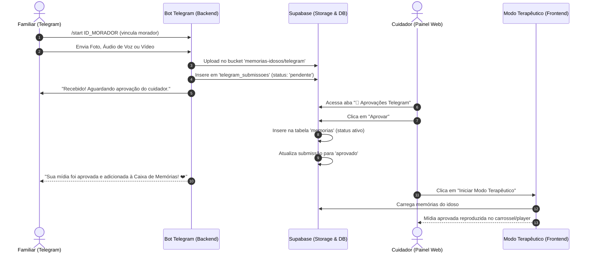

# Integração da Caixa de Memórias com o Telegram

Integração de um Bot no Telegram que permite que familiares enviem fotos, áudios (mensagens de voz) e vídeos diretamente para o sistema. As mídias recebidas entram em fila de moderação em uma **nova aba na Área do Cuidador** e, após aprovação, são gravadas no Supabase e disponibilizadas imediatamente no **Modo Terapêutico** do morador. A aba existente "Upload de Mídias (Nuvem)" permanece 100% inalterada.

---

## Arquitetura da Solução



---

## User Review Required

> [!IMPORTANT]
> **Token do Bot do Telegram**: Para conectar o bot, será necessário criar um bot gratuito no Telegram via [@BotFather](https://t.me/BotFather) e nos fornecer o token gerado (ex: `123456789:ABCdefGHI...`).
> Esse token será salvo de forma segura no arquivo `backend/.env`.

> [!IMPORTANT]
> **Tabela no Supabase**: Será executado um comando SQL simples no painel do Supabase (SQL Editor) para criar a tabela `telegram_submissoes` e `telegram_vinculos`. O script SQL completo está pronto e documentado abaixo.

---

## Script SQL para o Supabase

Execute este script no **SQL Editor** do seu projeto Supabase:

```sql
-- 1. Tabela para controlar qual familiar (chat_id) está vinculado a qual morador
CREATE TABLE IF NOT EXISTS telegram_vinculos (
    chat_id TEXT PRIMARY KEY,
    username TEXT,
    nome_usuario TEXT,
    idoso_id TEXT NOT NULL,
    updated_at TIMESTAMP WITH TIME ZONE DEFAULT TIMEZONE('utc'::text, NOW()) NOT NULL
);

-- 2. Tabela para armazenar as mídias pendentes de moderação do Telegram
CREATE TABLE IF NOT EXISTS telegram_submissoes (
    id BIGINT GENERATED BY DEFAULT AS IDENTITY PRIMARY KEY,
    idoso_id TEXT NOT NULL,
    chat_id TEXT NOT NULL,
    nome_familiar TEXT,
    tipo_midia TEXT NOT NULL, -- 'foto', 'audio', 'video'
    arquivo_url TEXT NOT NULL,
    legenda TEXT,
    status TEXT DEFAULT 'pendente', -- 'pendente', 'aprovado', 'recusado'
    motivo_recusa TEXT,
    created_at TIMESTAMP WITH TIME ZONE DEFAULT TIMEZONE('utc'::text, NOW()) NOT NULL
);

-- 3. Habilitar leitura/escrita para chaves anon caso use RLS simplificado
ALTER TABLE telegram_vinculos ENABLE ROW LEVEL SECURITY;
CREATE POLICY "Acesso público vinculos telegram" ON telegram_vinculos FOR ALL USING (true);

ALTER TABLE telegram_submissoes ENABLE ROW LEVEL SECURITY;
CREATE POLICY "Acesso público submissoes telegram" ON telegram_submissoes FOR ALL USING (true);
```

---

## Proposed Changes

### Backend (Node.js & Express)

#### [NEW] [telegramBot.js](file:///c:/Users/ARCANJO/Documents/caixa-memorias/backend/telegramBot.js)
- Inicializa o bot utilizando `node-telegram-bot-api` com polling ativo.
- Comando `/start <idoso_id>`: vincula o familiar ao idoso especificado ou solicita o ID caso o comando venha vazio.
- Escuta mensagens do tipo `photo`, `voice` / `audio`, e `video`.
- Baixa o buffer do arquivo diretamente da API do Telegram.
- Realiza upload automático no bucket `memorias-idosos/telegram/...` no Supabase Storage.
- Insere registro na tabela `telegram_submissoes` com `status: 'pendente'`.
- Envia mensagem de confirmação para o familiar: *"Recebemos sua memória com carinho! Ela será avaliada pelo cuidador antes de entrar na Caixa de Memórias."*
- Função exportada `notificarFamiliar(chatId, mensagem)` para enviar feedback de aprovação ou recusa.

#### [NEW] [telegramRoutes.js](file:///c:/Users/ARCANJO/Documents/caixa-memorias/backend/routes/telegram.js)
- Endpoint `GET /api/telegram/pendentes`: lista submissões pendentes.
- Endpoint `POST /api/telegram/aprovar`: aprova a submissão, copia para `memorias` e dispara notificação no Telegram.
- Endpoint `POST /api/telegram/recusar`: marca como recusada e avisa o familiar.

#### [MODIFY] [server.js](file:///c:/Users/ARCANJO/Documents/caixa-memorias/backend/server.js)
- Importa e inicializa o módulo do Telegram Bot se a variável `TELEGRAM_BOT_TOKEN` estiver preenchida.
- Registra a rota `/api/telegram`.

#### [MODIFY] [backend/package.json](file:///c:/Users/ARCANJO/Documents/caixa-memorias/backend/package.json)
- Adiciona as dependências:
  - `node-telegram-bot-api`
  - `@supabase/supabase-js`
  - `axios` (para download do stream do Telegram)

---

### Frontend (Next.js)

#### [MODIFY] [frontend/app/cuidador/page.js](file:///c:/Users/ARCANJO/Documents/caixa-memorias/frontend/app/cuidador/page.js)
- Adiciona novo botão de navegação por aba: **📲 Aprovações Telegram** com contador de itens pendentes (ex: `📲 Aprovações Telegram (3)`).
- Cria o painel da nova aba exibindo:
  - Lista de cards com mídias pendentes.
  - Informações do morador destinatário e do remetente (nome no Telegram, data e hora).
  - Prévia de mídia apropriada:
    - 📷 Fotos com visualização direta e ampliação.
    - 🎙️ Áudios com `<audio controls>` compatível com mensagens de voz do Telegram.
    - 🎥 Vídeos com `<video controls>`.
  - Exibição da legenda enviada.
  - Botão **✅ Aprovar**: Insere na tabela `memorias` do idoso, atualiza o status para `aprovado` e notifica o familiar.
  - Botão **❌ Recusar**: Altera status para `recusado` e notifica o familiar.
- Na aba **📋 Gerenciar Perfis**, adiciona um botão **📲 Link Telegram** em cada morador para copiar o link direto de envio (ex: `https://t.me/NomeDoBot?start=ID_MORADOR`) facilitando o compartilhamento com parentes.
- Mantém a aba **☁️ Upload de Mídias (Nuvem)** 100% intacta.

#### Compatibilidade com Modo Terapêutico
- Como a ação de aprovação insere a mídia na tabela `memorias` do morador com o mesmo padrão dos uploads manuais (`tipo_midia`, `arquivo_url`, `descricao`, `autor_registro`), o **Modo Terapêutico** (`/idoso/[id]`) exibirá as mídias aprovadas automaticamente, sem necessidade de qualquer alteração que possa quebrar a experiência imersiva existente.

---

## Verification Plan

### Testes Automatizados / Backend
1. Iniciar o backend com a variável `TELEGRAM_BOT_TOKEN` configurada e verificar log de conexão bem-sucedida do bot.
2. Simular endpoints da API de moderação (`/api/telegram/pendentes`, `/api/telegram/aprovar`, `/api/telegram/recusar`).

### Teste de Integração Prática (Fim a Fim)
1. **Envio via Telegram**:
   - Enviar `/start 1` no Telegram para vincular a um morador.
   - Enviar uma foto com legenda.
   - Enviar um áudio de voz.
   - Enviar um vídeo curto.
2. **Validação no Painel do Cuidador**:
   - Acessar `http://localhost:3000/cuidador` -> clicar na aba **📲 Aprovações Telegram**.
   - Verificar se as 3 mídias aparecem com previews funcionais (reproduzir áudio, vídeo e visualizar foto).
   - Clicar em **Aprovar** na foto e no áudio.
   - Clicar em **Recusar** no vídeo.
3. **Verificação no Telegram**:
   - Confirmar que o bot enviou mensagens de feedback no chat do Telegram para a aprovação e recusa.
4. **Verificação no Modo Terapêutico**:
   - Acessar o perfil do morador (`/idoso/1`).
   - Clicar em **Iniciar Modo Terapêutico**.
   - Confirmar que a foto e o áudio aprovados aparecem normalmente no carrossel.
5. **Verificação de Regressão**:
   - Acessar a aba **☁️ Upload de Mídias (Nuvem)** e confirmar que o upload manual continua funcionando perfeitamente.
